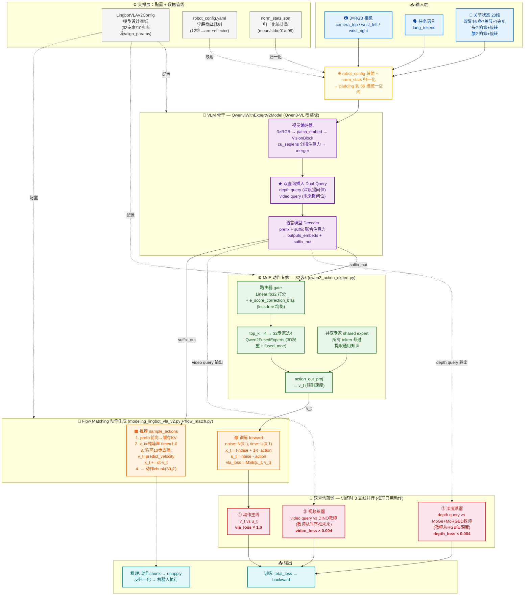

# LingBot-VLA 2.0 模型架构图

> **查看方式**：
> - VSCode：装扩展 `Markdown Preview Mermaid Support`，打开本文件预览
> - 在线：复制下方代码到 [mermaid.live](https://mermaid.live) 渲染 + 导出 PNG/SVG

---

## Mermaid 源码

---

## 架构要点

| 层 | 组件 | 核心作用 |
|---|---|---|
| ① 输入 | 3×RGB + 语言 + 状态 | 推理只需这 3 样(无深度/未来) |
| ② VLM 骨干 | Qwen3-VL 改装 | 看图听话 + 插入 depth/video 双查询 |
| ③ MoE 专家 | 32选4 + 共享专家 | 稀疏推理,容量大算得少 |
| ④ Flow Matching | 速度场学习 | 训练学方向,推理从噪声走到动作 |
| ⑤ 蒸馏 | 深度+视频教师 | 训练强化表征,推理只用动作受益 |
| ⑥ 输出 | loss / 动作chunk | 训练 backward;推理 unapply 还原 |
| ⑦ 配置 | Config+robot_config+norm | 设计图纸+翻译+归一化 |
