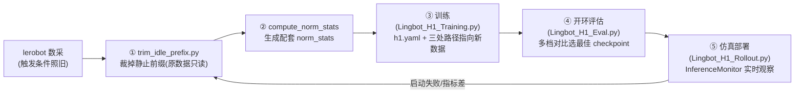

# LingBot-VLA 2.0 全流程操作学习文档

> 场景:单卡 RTX 5090 32GB,conda 环境 `lingbotv2`,H1 仿真数采(LeRobot v3.0)。
> 本文档按**实际操作流水线**组织:数采 → 裁剪 → 归一化 → 训练 → 评估 → 部署 → 排障。
> 配套笔记:[YAML配置学习笔记.md](YAML配置学习笔记.md)(训练配置详解)、
> [Lingbot_H1_Training.py](Lingbot_H1_Training.py)(训练启动器)、
> [trim_idle_prefix.py](trim_idle_prefix.py)(数据裁剪)、
> [Lingbot_H1_Eval.py](Lingbot_H1_Eval.py)(评估)、
> [Lingbot_H1_Rollout.py](Lingbot_H1_Rollout.py)(仿真部署+监控)。

---

## 〇、流水线总览



**核心心法**:每一环的产物(数据副本、norm 统计、checkpoint)都和它的输入**绑定配套**,
换数据就要换统计、换路径;"最优 checkpoint"靠**多存档 + 评估选档**保证,不靠赌超参。

---

## 一、环境与启动规范

| 事项 | 规范 |
|---|---|
| 解释器 | 一律 `conda activate lingbotv2`;★ 绝对路径 `/home/mjq/miniconda3/bin/python` 是 **base 环境**,会报 `No module named 'numpy'`(conda activate 只改 PATH,绝对路径绕过激活) |
| 自纠正保险 | 本项目所有 `mjq_lingbotvla_v2/` 启动器开头都有"解释器自纠正":检测非 lingbotv2 时 `os.execv` 自动重启。**必须放在所有第三方 import 之前**,否则 import 先炸、自纠正永远轮不到 |
| 工作流 | VSCode 打开对应 .py 点右上角 ▶;终端跑则先 activate |
| 红线 | 同事的 conda 环境 `lingbotvla` 和 `/home/mjq/code/cyx/` 目录**永不修改**;模型权重放项目 `models/` 内 |

---

## 二、数采(lerobot)——触发条件照旧,不用改

**结论先行**:不需要"触发后立刻摇操"这种严苛要求。开头的静止段交给③裁剪模块处理。

已验证的数据事实(101 条 H1 仿真数采):

| 事实 | 数值 | 含义 |
|---|---|---|
| 双臂静止前缀 | 中位 18 帧(0.6s)/ 均值 25 / 最长 105 | 每条轨迹开头手臂确实停一下 |
| 头部云台 | **从第 0 帧就在动**(0.02~0.04 rad) | 数采视频"一点开就在动"的真相:**动的是头不是手臂** |
| 全程静止的废轨迹 | 3 条(#3/5/32,共 1777 帧) | 操作员触发后没动,整条丢弃 |
| 视频文件 | 每相机 5 个 mp4,**~26 条轨迹的合辑** | `file-000.mp4` ≠ 一条轨迹;总帧数 78108 = parquet 总行数,逐帧可对查 |

⚠️ **判断"动没动"要用 parquet 关节日志,不要靠看视频**:头部相机移动造成整幅画面平移
(~10px,31% 像素变化),人眼观感是"在动",但手臂可能纹丝不动(逐帧变化 3e-6 rad = 记录精度底噪)。

LeRobot v3.0 布局要点(裁剪/排查都要用):
- 多条 episode **连续存进同一个 mp4**,episode 元数据表(`meta/episodes/chunk-000/*.parquet`)
  记录每条在该 mp4 里的 `from_timestamp`;
- 训练加载器按 `from_timestamp + 行timestamp` 抽帧(这就是"零重编码裁剪"的基础);
- `load_episodes` 会剥掉 `stats/` 列(per-episode 统计不进训练路径);
- episode 列表**按位置索引**,episode_index 必须连续 0..N-1,不能留空洞。

---

## 三、数据裁剪模块 [trim_idle_prefix.py](trim_idle_prefix.py)

### 为什么裁
"开局 home 位姿 + 桌面完整场景"这个视觉区域,动作标签几乎 100% 是"stay"
(全数据 home 位姿帧 4079 stay : 709 move = 5.8:1,且那 709 是轨迹中途路过 home、视觉上下文不同的帧)。
部署**恰恰从这个区域出发** → 模型学会"别动" → 启动失败。裁掉前缀后,
episode 第 0 帧视觉 ≈ home、标签 = 动作已起步。

### 怎么裁(零视频重编码)
只改三处元数据,mp4 一字节不动、零画质损失:
1. `data/*.parquet`:丢每条开头 onset 行,重编 index/frame_index/timestamp/episode_index;
2. `meta/episodes/`:`from_timestamp += onset/fps`(视频里新起点,在 1/30 网格上整数帧平移),length/index 范围同步;
3. `meta/info.json`:total_episodes / total_frames。

onset 判定:手臂 14 维(state[2:16],腰和头不算)相邻帧差 max > 0.004 rad 的首帧;
整条从未超过阈值 → 废数据整条丢;裁后不足 100 帧 → 整条丢。

### 用法
```bash
python mjq_lingbotvla_v2/trim_idle_prefix.py             # dry-run:只统计不写盘
python mjq_lingbotvla_v2/trim_idle_prefix.py --apply     # 生成副本(目标已存在会拒跑)
python mjq_lingbotvla_v2/trim_idle_prefix.py --apply --force   # 覆盖已有副本
```
本次账目:101 条/78108 帧 → **98 条/73881 帧**(裁前缀 2450 帧=3.1%,丢静止整条 1777 帧)。
原数据全程只读,副本在 `data/h1_build_pick_v2_trimmed`(含 2.2G 视频复制)。

### 通用性边界
| 部分 | 通用性 |
|---|---|
| 裁剪机制(v3.0 + 视频存储格式) | ✅ 任何同格式数据集 |
| 逐条自适应 onset / 废数据剔除 | ✅ 操作员快慢自动适应 |
| `ARM_SLICE=(2,16)` | ⚠️ 绑定 H1 关节布局,换机器人必改 |
| `EPS=0.004` | ⚠️ 按仿真数采噪声调的;**真机噪声大,预计要放宽到 0.008~0.01** |
| `CAM_KEYS` 三路相机 | ⚠️ 换相机配置要改 |

→ 对"同一台 H1、同一套数采流程"就是通用工具:换 `SRC`/`DST` 两行路径即跑。
**以后数采不用改触发条件**,采集完批量跑一遍裁剪即可。

### 裁剪后验证(方法可复用)
用**训练同款 loader** 同时加载原数据和副本,逐帧比对:
副本第 k 帧 === 原数据第 k+onset 帧 —— 状态、50 帧动作块、pad 标志、三路相机图像
**比特级一致**(18/18 项全过,含首帧/中段/结尾 clamp+pad 路径)。
★ 教训:验证数据管线必须用消费方(loader)实读比对,不能只信 parquet 本身。

---

## 四、★ 数据加载 bug:重复文件加载(本项目最大发现)

**现象**:验证裁剪副本时发现 loader 加载出 3,601,457 行(应为 73,881);原数据同样中招(3,935,163 行 vs 78,108)。

**根因**:[base_dataset.py](../lingbotvla/data/vla_data/base_dataset.py) 的 `load_hf_dataset` 按 episode
展开文件列表,v3 里**多条 episode 共享同一 parquet 分片** → 列表必然含重复 →
`datasets.load_dataset` 不去重 → file-000 被加载了 N 遍,行号与 index/episode 边界全部错位。
官方路径 `load_nested_dataset` 无此问题,是仓库重写时引入的。

**对第一次训练的实际影响**(逐项查实):
- 采样 idx ≥ 首文件行数的**一半批次**读到错位行:画面/状态是某一帧,动作块被错误 clamp 成"该集末尾动作 ×50";
- v2 损失**收了 `action_is_pad` 但根本没用**(pi0 有 `in_episode_bound` 掩码,v2 没有)→ 这半数是**真实毒药监督**:"任意画面 → 恒定末态动作";
- episode 60~100(**41 条**)从未作为当前帧被采样;旧 norm 统计只覆盖前 60 条;旧开环评估里 traj≥70 的真值也是错位行。

**修复**(已完成):`files = list(dict.fromkeys(files))` 保序去重一行,位于
[base_dataset.py:138](../lingbotvla/data/vla_data/base_dataset.py#L138)。

⚠️ 因此**旧模型的所有结论(最佳档 15000、MSE 数值、"过拟合"判断)不能外推到新训练** —— 有效数据量和质量都变了。

---

## 五、归一化统计(每份数据必须重算)

```bash
LOCAL_RANK=0 RANK=0 WORLD_SIZE=1 MASTER_ADDR=127.0.0.1 MASTER_PORT=29612 \
python scripts/compute_norm_stats.py configs/vla/norm_compute/h1_norm.yaml \
    --data.data_name h1 \
    --data.train_path <数据集绝对路径> \
    --data.norm_path assets/norm_stats/<名字>.json
```
⚠️ 直接 python 跑要手动补 `LOCAL_RANK` 等环境变量(否则 `TypeError: int() ... NoneType`);
走 train.sh/torchrun 则自动注入。

- 裁剪副本配套统计:`assets/norm_stats/h1_trim.json`(与旧 h1.json 均值偏移 ≤0.13 rad,量级合理);
- ★ 一致性铁律:**norm 表、robot_config、checkpoint 三者绑定同一模型**;改映射必重算 norm;
  训练、评估、部署用**同一份**统计表。

---

## 六、训练配置(详解见 [YAML配置学习笔记.md](YAML配置学习笔记.md))

三份 YAML 的关系:`h1_norm.yaml`(算统计,无 model 段)→ `robot_configs/h1.yaml`(20 维→55 维字段翻译)
→ `real_robot/h1.yaml`(训练主配置)。**改映射必须重算 norm**。

32GB 单卡适配核心(train 段):

| 参数 | 值 | 一句话依据 |
|---|---|---|
| `enable_mixed_precision` / `enable_fp32` | false / false | fp32 主权重 24G 必 OOM;纯 bf16 权重 12G |
| `train_expert_only` | true | 冻结 VLM,梯度/优化器只剩专家(~1.7B),显存 23G/32.6G |
| `enable_gradient_checkpointing` | true | 重算换显存,32G 必须 |
| `micro_batch_size` / `gradient_accumulation_steps` | 1 / 4 | micro 管显存,accum 管梯度质量,global 必须自洽=4 |
| `lr` / `loss_type` | 1e-4 constant / L1_fm | 仿真配方;L1 不平方放大夹爪阶跃 |

历史坑(详见 YAML笔记):① waist 静止维度进 meanstd 会被除以 ~0 的 std 放大成噪声(不映射);
② `prompt_type: global`(数据无 subtask 字段);③ 关蒸馏训练要靠 `module_utils.py` 白名单跳过 checkpoint 里的蒸馏头键。

---

## 七、训练执行

### 开训前检查清单(血泪教训:磁盘)
| 检查项 | 标准 |
|---|---|
| 磁盘余量 | **≥ 训练将写入的 checkpoint 总量**(save 档数 × 27G;8 档 = 216G)。曾因 213G 旧档 + 205G 余量差点在 15 小时后写满盘 |
| norm 文件 | 与数据配套的那份存在(`h1_trim.json`) |
| 路径三处 | 启动器 `DATA_PATH / NORM_STATS / OUTPUT_DIR` 指向新数据、新统计、**新输出目录**(不覆盖旧档,enable_resume 才不会误续旧任务) |
| GPU | 空闲(`nvidia-smi`) |
| 模型权重 | `models/lingbot-vla-v2-6b`、`models/Qwen3-VL-4B-Instruct` 就位 |

### 启动与观察
VSCode 打开 [Lingbot_H1_Training.py](Lingbot_H1_Training.py) 点 ▶(自带解释器自纠正)。头几分钟确认:
1. 打印的 数据/归一化/输出 三路径正确;
2. 第一步反向不 OOM(显存 ~23G/32.6G);
3. 每 epoch 步数 = 帧数 ÷ 4(裁剪副本 = **18470**;数字变了 = 新数据生效了)。

全程 ~18h,每 2500 步落一档到 `output/<任务>/checkpoints/global_step_*/`(每档 27G,含评估/部署用的 `hf_ckpt` 12G;
★ `hf_ckpt` 不能挪位置——policy 按"往上三级找 lingbotvla_cli.yaml"自动识别)。

### 关于"参数是否最优"
- 超参层面**没有必须改的项**;真正的机制是 `save_steps 2500` 多存档 + 开环评估选最佳档;
- 若训完最后一档指标仍在变好 → `enable_resume: true` 直接续训加 5000~10000 步再评,比预先猜大 max_steps 稳;
- ★ 一次实验控制变量数:本轮只改了"数据裁剪 + loader 修复"两个变量,训好了才知道功劳归谁;不要再叠加其他改动。

---

## 八、训练后:开环评估选档

[Lingbot_H1_Eval.py](Lingbot_H1_Eval.py) 自动循环多档 checkpoint,在验证轨迹上逐帧对比
"模型预测动作 vs 数采真实动作",输出 MSE/MAE 对比表 + 推荐最佳档。

```bash
python mjq_lingbotvla_v2/Lingbot_H1_Eval.py              # 评 CHECKPOINT_STEPS 里全部档
python mjq_lingbotvla_v2/Lingbot_H1_Eval.py 5000 10000   # 命令行指定档位
```
注意:
- `DATA_PATH` 要换成**与训练同一份**数据(裁剪副本训练 → 用副本评估);
- `--norm_path` 必须与训练同一份统计表,否则尺度错位、数字无意义;
- 建议节奏:`global_step_5000` 出来先冒烟评一次 → 训完全档评 → 选档进部署。

---

## 九、仿真部署与实时监控

[Lingbot_H1_Rollout.py](Lingbot_H1_Rollout.py):接 MuJoCo 仿真,实时观察推理结果。
换新模型时改三处:checkpoint 路径(`output/h1_trim/checkpoints/global_step_*/hf_ckpt`)、
`--norm assets/norm_stats/h1_trim.json`、(评估过的)任务参数。

### InferenceMonitor 读法
- **白线(粗)** = 当前状态,**黄线(细)** = 本步动作,**青线 = 本次前向的 50 步规划**;
- 黄紧贴白 = 动作基本跟随;青是平的 = 模型在说"别动";白线离开起始高度 = 机器人真的动起来了;
- 顶栏:frame / fwd(第几次前向)/ infer-ms / FPS;`--no-monitor` 关闭。

### chunk 机制(为什么 50 帧推理一次,能不能延长)
- 训练 `chunk_size=50` 固定了动作块长度;部署 `use_length ≤ 50` 是**硬约束**(policy 内 assert,超了直接崩);
- 想更"实时"只能**缩短**重推理间隔:`--reinfer-every K` 每 K 帧重规划(MPC 式滚动 horizon);
  每次前向 ~0.35s,K<10 时 30Hz 会被拖垮,需权衡;
- "启动成功"的判据:开局 60s 内白线离开起始高度、青色块不再是平的。

---

## 十、故障排查实录:启动失败(抖动不走)

**症状**:部署开局双臂抖动但无净位移,每 50 帧重新前向,监控里青色规划块是平的、黄线紧贴白线。

**诊断链(按时间线)**:
1. 抖动 = flow-matching 去噪噪声围绕"stay"输出;每次重规划仍说"stay" → 不是单次采样抖,是模型立场就是"别动";
2. 数据统计:开头静止前缀(中位 18 帧)+ home 区域标签 5.8:1 → 冷启动视觉区域几乎 100% "stay";
3. 反证:SmolVLA 同一份数据 4/10 → **数据不是死刑,是"数据偏置 × 训练配方"的相互作用**;
4. 帧级验证用户疑问"视频一点开就在动":相位相关实验证明画面变化 = 头部相机平移(手臂静止区间也有 31% 像素变化);
5. 裁剪副本验证时**顺藤摸瓜发现 loader 重复加载 bug**(第四节)→ 一半批次是"任意画面→恒定末态"的毒药监督,与"平的规划块"直接吻合。

**修复组合拳**:裁剪静止前缀(数据侧)+ loader 保序去重(管线侧)→ 重训。

**knowingly 保留**:v2 损失不掩码 `action_is_pad`(episode 末尾 chunk 尾巴学"保持末态"),
影响面小(~7% 样本的尾部几步);本轮不动,留作以后单独实验。

---

## 十一、可复用原则清单

1. **一致性铁律**:norm 表 / robot_config / checkpoint 三绑定;换数据必换统计。
2. **官方配置 ≠ 你的硬件**:抄模板前先看隐含资源假设(fp32 全参 = 80G 级集群)。
3. **数据统计驱动参数**:写任何 data/train 参数前,先有逐维统计事实。
4. **显存三大头先算账**:权重 + 梯度 + 优化器状态。
5. **磁盘同样要算账**:训练前算"档数 × 单档体积",否则十几小时后写满盘。
6. **砍组件前想 checkpoint**:训练时不要的模块,预训练权重里可能还带着(严格加载会炸)。
7. **管线验证用消费方实读**:数据对不对,让 loader 读出来比,别只看文件本身。
8. **视频观感 ≠ 关节事实**:判断"动没动"用 parquet 关节日志,相机在动不代表手臂在动。
9. **一次实验控制变量**:数据、管线、超参别同时大改,否则训好了说不清功劳。
10. **选档机制 > 赌超参**:多存档 + 开环评估挑最佳,比预先猜一组"最优参数"可靠。

---

## 附:关键数字速查

| 项 | 数值 |
|---|---|
| 原数据 | 101 episodes / 78108 帧 / fps30 / episode 均长 ~25.8s |
| 裁剪副本 | 98 episodes / 73881 帧(裁 3.1% + 丢 3 条静止整条) |
| 静止前缀 onset | 中位 18 / 均值 25 / p90 46 / 最长 105 帧(阈值 0.004 rad/帧) |
| home 区域标签 | 4079 stay : 709 move = 5.8:1(裁前) |
| 训练 | 20000 步 × batch4 ≈ 1.08 epoch;18470 步/epoch;~18h;显存 23G/32.6G |
| checkpoint | 每 2500 步一档 × 27G(hf_ckpt 12G 用于评估/部署) |
| 推理 | 前向 ~0.35s;use_length ≤ 50 硬约束;重规划间隔只能缩短 |
| 加载器 bug 影响 | 原数据 hf 393 万行(应 78108);半数批次错配;ep60~100 未被采样 |
