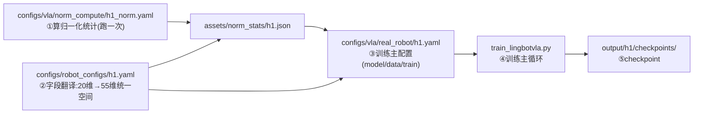

# LingBot-VLA 2.0 训练 YAML 配置学习笔记

> 场景：用 H1 仿真数采数据（LeRobot v3.0，101 episodes / 78108 帧 / fps30）
> 在单卡 RTX 5090 32GB 上对 lingbot-vla-v2-6b 做后训练（post-training）。
> 本笔记记录：涉及的每个 YAML 的作用、撰写时踩的坑、根因与解决思路。
> 配套架构图见 `LingBot-VLA-2.0-架构图.mmd`，训练启动器见 `Lingbot_H1_Training.py`。

---

## 一、配置文件地图：一次训练涉及哪些 YAML



| 文件 | 角色 | 谁读它 | 何时用 |
|---|---|---|---|
| `configs/vla/real_robot/h1.yaml` | **训练主配置**：模型/数据/训练三段 | `train_lingbotvla.py` 的 `parse_args` | 训练全程 |
| `configs/robot_configs/h1.yaml` | **字段翻译字典**：把 H1 的 20 维原始数据切片映射进 55 维统一空间 | 数据集加载器（`data_name: h1` 按名字找到它） | 训练 + 部署 |
| `configs/vla/norm_compute/h1_norm.yaml` | **归一化统计专用配置**（无 model 段！） | `compute_norm_stats` 任务 | 只跑一次 |
| `assets/norm_stats/h1.json` | 归一化统计表（mean/std/q01/q99…） | 数据集加载器 | 训练 + 部署 |
| `configs/vla/real_robot/real_robot.yaml` | 官方真机模板（参考来源） | — | 对照学习 |
| `configs/vla/robotwin/robotwin.yaml` | 官方仿真模板（参考来源） | — | 对照学习 |

**核心关系**：robot_config 决定"哪 18 维是真的、放在 55 维的哪些槽位"，
norm_stats 决定"这些维度怎么缩放"，主配置把两者串起来并决定"怎么训"。
**改了映射（robot_config）就必须重算 norm** —— 两把钥匙必须配同一把锁。

---

## 二、每个 YAML 的作用详解

### 1. `configs/robot_configs/h1.yaml` —— 字段翻译（数据进模型的第一道工序）

H1 原始数据 20 维（`meta/info.json` 的 features.names）：
腰 2 (`[0:2)`) + 左臂 7 (`[2:9)`) + 右臂 7 (`[9:16)`) + 头 2 (`[16:18)`) + 夹爪 2 (`[18:20)`)。

配置分四段：

| 段 | 作用 | 本例 |
|---|---|---|
| `states:` | 观测状态怎么拼 | arm 14 + head 2 + effector 2 = 18 维 |
| `actions:` | 动作怎么拼（`subtract_state` 决定学绝对动作还是增量） | 仿真用 `False`（同 RoboTwin 约定）；真机建议 `True` |
| `images:` | 相机名映射 | head_rgb→camera_top，wrist→camera_wrist_left/right |
| `norm_stats:` | 指向统计表 | assets/norm_stats/h1.json |

写法要点：`origin_keys` 里同名字段可以出现多次，靠 `start/end` 切片再拼接 ——
左右臂都来自 `observation.state`，各切 7 维。

### 2. `configs/vla/norm_compute/h1_norm.yaml` —— 算统计（一次性工具配置）

与主配置最大的区别：**没有 model 段**（`compute_norm_stats` 的 Arguments 不认模型），
train 段只留 `chunk_size / micro_batch_size / output_dir / max_steps` 四个必填项。
`output_dir` 给临时目录、`max_steps: 1` —— 因为算 norm 不真训练。

### 3. `configs/vla/real_robot/h1.yaml` —— 训练主配置（三段式）

**model 段**：权重路径、tokenizer 路径、`config_key: LingbotVLAV2Config`（选模型类）、
`moe_implementation: fused`。
⚠️ 机制：`train_lingbotvla.py:399` 的 `config_kwargs = {**vars(args.model), **vars(args.train)}`
会把 **model 段 + train 段合并成模型图纸对象的构造参数** —— train 段的
`train_expert_only` 之所以能冻结 VLM，就是从这条路流进 `LingbotVLAV2Config` 的。

**data 段**：`data_name`（=robot_config 文件名）、`train_path`、`joints`（声明统一空间
槽位，未映射的槽位也要声明以对齐模型头维度）、`cameras`、`prompt_type`、
`norm_type`（每槽位归一化方式）、`norm_stats_file`、`num_workers`、`use_future_image`。

**train 段**：批次/优化器/损失/显存/时长/MoE 全部在此（详见第四节速查表）。

---

## 三、踩坑实录（按调试时间线）

### 坑 ①：waist 静止维度 → meanstd 会把噪声放大成灾难

- **现象**：对 78108 帧逐维统计发现腰部两维全程静止（range ±0.004，std≈2e-4）。
- **根因**：meanstd 归一化是 `(x-mean)/std`。std≈2e-4 意味着除以一个接近零的数 ——
  数值噪声被放大到 ±21（正常特征归一化后在 ±3 内），模型输入直接畸形。
- **解决**：robot_config 里**不映射 waist**（h1.yaml 的 joints 里仍声明
  `waist.position: 4`，只为对齐模型头维度，但不写映射就不生效），并重算 norm。
- **经验**：写映射前先做逐维统计；"这维没动"比"这维动了"更值得警惕。
  判断标准：`std < 1e-3` 的维度不要进 meanstd。

### 坑 ②：prompt_type 默认值与数据格式不匹配

- **根因**：默认 `both` 会找 subtask（子任务文本）字段，而本数据只有一条全局任务串。
- **解决**：`prompt_type: global`。
- **经验**：数据里有什么字段，就选什么模式；拿不准时先看 `meta/task_index.json`
  和 episode 的任务字段再定。

### 坑 ③：关蒸馏训练 → checkpoint 蒸馏头键报 KeyError

- **现象**：首跑报
  `KeyError: Unexpected key 'model.current_video_align_head...' found in state dict during Post-Training`
- **根因**：预训练 checkpoint 里带着视频/深度蒸馏头（你架构图的 D2/D3 支线）共
  10 个模块 80 个键；我们首跑关蒸馏（不写 `align_params`），模型没构建这些模块，
  而 post-training 的权重加载是严格模式。
  查证：官方**所有** post-training 配置都开着蒸馏 —— 这条路官方加载器自己没走过。
- **解决**：`lingbotvla/models/module_utils.py` 加 `OPTIONAL_DISTILL_PREFIXES` 白名单
  （10 个前缀）：关蒸馏时这些键打日志跳过，其余键严格校验不变；开蒸馏时模块存在、
  键正常加载，白名单不生效。
- **经验**："官方配置的并集"不等于"支持的所有路径"；砍掉某个训练组件前，
  想到 checkpoint 里可能留着它的权重。

### 坑 ④：32GB 显存三连爆（最重要的一课）

**4a. 全参 + fp32：首步反向就 OOM**
- **现象**：`torch.OutOfMemoryError ... 29.41 GiB allocated`（卡共 31.33GB）
- **根因链**：
  1. `enable_mixed_precision: true`（默认值！）→ `torch_parallelize.py:108` 执行
     `model.float()` → 6B 模型整体 fp32 主权重 = **24GB 常驻**；
  2. 官方配置的 `enable_fp32: true` 再让计算也走 fp32；
  3. 全参训练还要梯度 12GB+优化器状态 —— 官方是在 80GB×N 卡上跑的。
- **解决**：`enable_mixed_precision: false` + `enable_fp32: false`（纯 bf16，12GB 权重）。

**4b. 只关精度还不够 → 冻结 VLM**
- 即使权重降到 12GB，全参的梯度 + Muon 状态仍超 32GB。
- **解决**：`train_expert_only: true` → 冻结整个 Qwen-VLM（4B），只训动作专家（~1.7B）。
  这是 pi0 系 VLA 微调的标准配方：VLM 的视觉语言表征来自预训练，单任务微调只需调动作生成。
  冻结的额外红利：VLM 前向无梯度 → 不存激活、反向不计算，三重省显存。
- 依据：这个仓库的 Muon 优化器动量/方差/**Kahan 补偿缓冲**（修正 bf16 小更新被舍入
  吞掉的问题）全部按 bf16 设计 —— "bf16 参数 + bf16 Muon"是预期内的低显存组合。

**4c. 纯 bf16 → dtype 不匹配 RuntimeError**
- **现象**：`RuntimeError: mat1 and mat2 must have the same dtype, but got Float and BFloat16`
  （`state_proj(state)`：数据管线给 fp32，模型权重是 bf16）
- **根因**：数据管线输出 fp32 张量；以前没炸是因为 `model.float()` 把权重也升到 fp32。
- **解决**：`train_lingbotvla.py` 的 batch 上卡处加自适应 cast —— 浮点输入统一转成
  `next(model.parameters()).dtype`。官方 fp32 路径下模型是 fp32，cast 为 no-op，
  不改变官方行为。

**为什么不用 CPU offload**：`enable_fsdp_offload` 只支持 FSDP1，且与梯度累积互斥
（`arguments.py:636`）—— accum 4 是 MoE 路由稳定性的关键，不能牺牲。

**最终结果**：显存 23.0/32.6GB，3.2~3.4s/步，余量 9.6GB 稳定运行。

### 坑 ⑤：显存账要算"三个大头"

写 yaml 前先算：**权重 + 梯度 + 优化器状态**（可训练参数的 1~2 倍体量）。
经验公式（单卡无 shard）：

| 精度 | 权重 | 梯度 | 优化器 | 6B 全参合计 |
|---|---|---|---|---|
| fp32 | 24GB | 24GB | 24GB+ | >72GB ✗ |
| bf16 全参 | 12GB | 12GB | ~12GB | ~36GB ✗（32GB 仍不够）|
| bf16 + 冻结 VLM | 12GB | 3.4GB | 3.4GB | **~20-23GB ✓** |

### 坑 ⑥：启动环境（非 yaml，但同属"跑起来"的一环）

- 现象：`ModuleNotFoundError: No module named 'numpy'`
- 根因：用了绝对路径 `/home/mjq/miniconda3/bin/python`（**base 环境**的解释器），
  `conda activate` 只改 PATH，绝对路径会绕过激活。
- 解决：启动器开头加"解释器自纠正"（检测非 lingbotv2 环境时 `os.execv` 换正确的
  python 重启自己）+ `.vscode/settings.json` 固定解释器 → VSCode 点 ▶ 即可训练。

---

## 四、最终生效配置速查（数据驱动 + 硬件适配）

### 数据统计 → 参数决策

| 数据事实（78108 帧实测） | 决策 | 依据 |
|---|---|---|
| 单任务、episode 均长 25.8s（773 帧） | `chunk_size: 50` | 50 步=1.67s，覆盖一次抓/放过渡 |
| 动作平滑（mean\|a−s\|=0.0098）但夹爪阶跃（max 1.05） | `loss_type: L1_fm` | L1 不平方放大稀疏跳变 |
| 仿真数据、单任务、78k 帧 | `lr: 1e-4` + constant + ~1 epoch 起步 | RoboTwin 同款量级；微调无需预热衰减 |
| 无 subtask 字段 | `prompt_type: global` | 数据里只有全局任务串 |
| 各维连续平滑无长尾 | `norm_type: meanstd` | bounds 系列适合有离群点的真机数据 |
| 3 路 av1 视频解码 | `num_workers: 8` | 24 核 CPU，喂饱 GPU |

### 硬件（5090 32GB）→ 参数决策

| 参数 | 值 | 依据 |
|---|---|---|
| `micro_batch_size` | 1 | 显存只看 micro；6B + 检查点下的保守值 |
| `gradient_accumulation_steps` | 4 | 单卡把等效 batch 做到 4：MoE 路由 + flow-matching 在 batch=1 下噪声大 |
| `global_batch_size` | 4 | **必须 = micro × 卡数 × accum**（自动核算，手写须一致）|
| `train_expert_only` | true | 冻结 VLM，梯度/优化器/激活只剩专家 |
| `enable_mixed_precision` / `enable_fp32` | false / false | 避免 fp32 主权重 24GB |
| `enable_gradient_checkpointing` | true | 重算换显存，32GB 必须 |
| `use_compile` | false | 首跑先求通；稳定后可开提速 |
| `max_steps` | 20000 | ×batch4 = 8 万样本 ≈ 1 epoch（19527 步/epoch）；跑完看 loss 再加 |
| `save_steps` | 2500 | 全程 8 档，便于挑最佳 checkpoint |
| `enable_resume` | true | 中断自动从最新档续训 |

### 实测结果（验证过的事实）

- 训练稳定：20000 步 ETA ~18 小时；显存 23.0GB / 32.6GB；GPU 利用率 100%
- Loss：起步 ~0.6 → Step 670 时 ~0.24（flow-matching L1，学习有效）
- 日志字段对照：`VLA_Loss`=去噪方向误差(主信号)；`SeqWise/RouterZ`=MoE 路由辅助损失；
  `MaxVio`=专家负载失衡(=(max−avg)/avg，3~3.5 正常)；`GradNorm`=裁剪前梯度范数；
  `Expert_LR`(2.83e-4)=`use_moe_expert_lr` 给专家的独立学习率
- Checkpoint（每档 27GB）：`extra_state`(续训状态) + `model`(DCP 权重 12G) +
  `optimizer`(Muon 状态 3.4G) + `hf_ckpt`(HF 格式 12G，**评估/部署用这个**)；
  无自动清理，8 档约 216GB，磁盘紧张时手动删旧 `global_step_*`

---

## 五、可复用的原则

1. **一致性铁律**：`norm_type` 在"算 norm 的 yaml"和"训练的 yaml"里必须逐槽位一致；
   改映射（robot_config）必须重算 norm；checkpoint、norm、robot_config 三者绑定同一模型。
2. **官方配置 ≠ 你的硬件**：抄模板前先看它的隐含资源假设（fp32 全参 = 80GB 级集群）。
3. **数据统计驱动参数**：写任何一个 data/train 参数前，先有逐维统计的事实依据。
4. **显存三大头先算账**：权重+梯度+优化器；micro 管显存，accum 管梯度质量，global 必须自洽。
5. **砍组件前想 checkpoint**：训练时不需要的模块，预训练权重里可能还带着（严格加载会炸）。
6. **精度降级要看配套**：bf16 参数需要 bf16 设计的优化器（Muon 补偿缓冲）+ 输入 dtype 统一。
7. **轮数换算**：steps/epoch = 帧数 ÷ global_batch（78108÷4≈19527）；
   `num_train_epochs` 与 `max_steps` 谁先到谁停车。

---

## 附：命令速查

```bash
# ① 算归一化统计（改映射后重跑）
python scripts/compute_norm_stats.py configs/vla/norm_compute/h1_norm.yaml \
    --data.data_name h1 --data.train_path <数据集绝对路径> \
    --data.norm_path assets/norm_stats/h1.json

# ② 训练（VSCode 打开 Lingbot_H1_Training.py 点 ▶，等价于：）
CUDA_VISIBLE_DEVICES=0 bash train.sh tasks/vla/train_lingbotvla.py \
    ./configs/vla/real_robot/h1.yaml \
    --data.data_name h1 --data.train_path <数据集绝对路径> \
    --data.norm_stats_file assets/norm_stats/h1.json \
    --train.output_dir output/h1

# ③ 看曲线
tensorboard --logdir output/h1/runs

# ④ 训练完开环评估(推荐:多档对比启动器,VSCode 点 ▶ 即可)
#   mjq_lingbotvla_v2/Lingbot_H1_Eval.py —— 自动评 10000/15000/20000 三档并出对比表
python scripts/open_loop_eval.py \
    --model_path output/h1/checkpoints/global_step_XXXX/hf_ckpt --robo_name h1 \
    --data_path <数据集绝对路径> --use_length 50
#   ★ hf_ckpt 不能挪位置:policy 自动识别依赖 output/h1/lingbotvla_cli.yaml
#     (官方按 hf_ckpt 往上三级查找);--norm_path 必须用训练时同一份统计表
```
